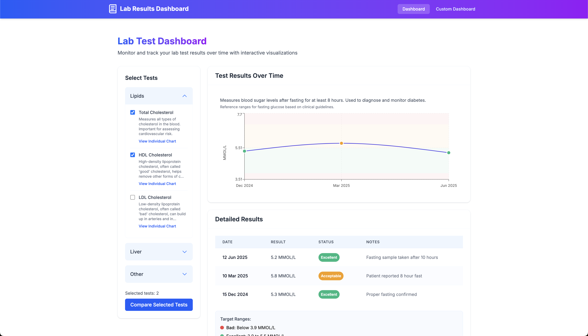
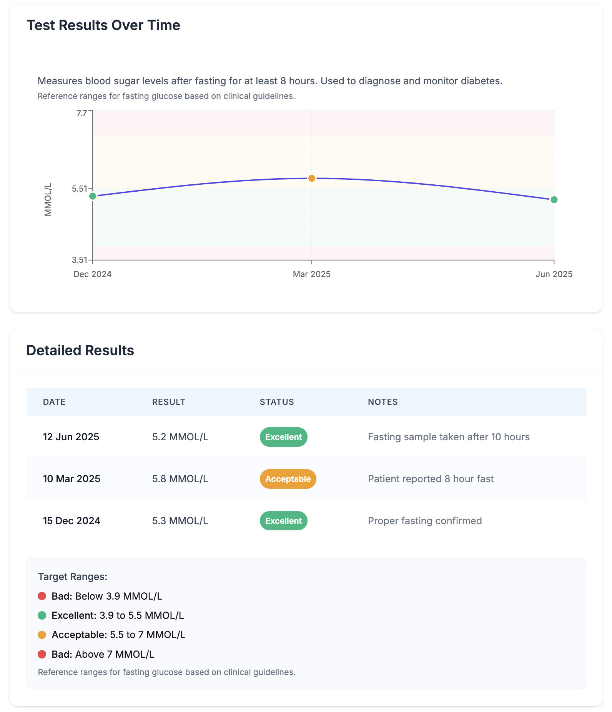
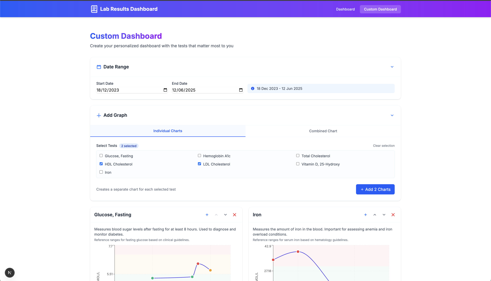
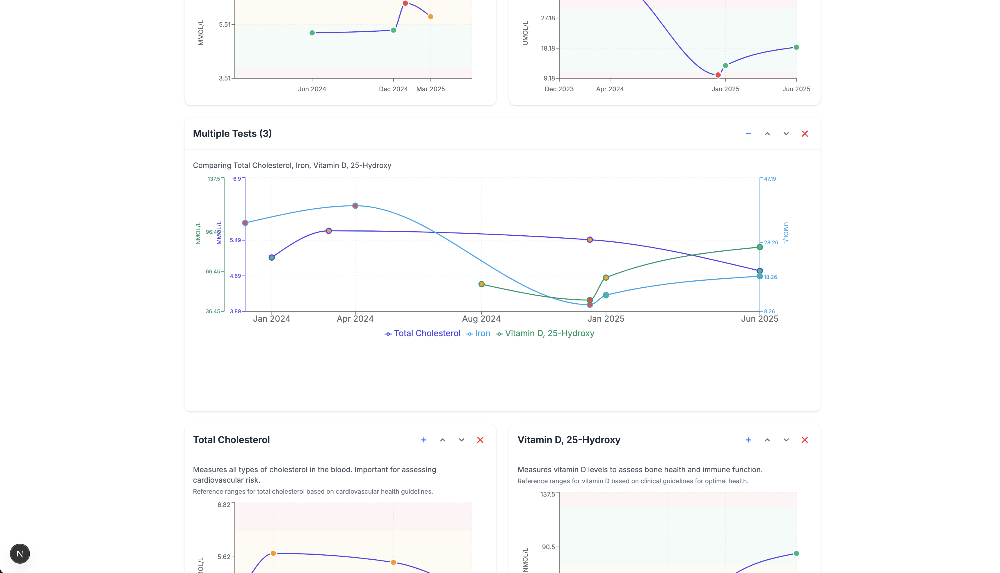

# Lab Test Dashboard



A modern, interactive dashboard for visualizing and tracking laboratory test results over time. This application helps users monitor their health metrics with intuitive visualizations, trend analysis, and customizable dashboards.

## 🌟 Motivation

I created this dashboard because I've accumulated numerous test results from managing my diabetes over the years. Unfortunately, most medical offices don't provide easy access to historical data - test results are typically scattered across individual forms or PDFs, making it difficult to track trends over time. This tool helps consolidate and visualize that data in a meaningful way.

## ✨ Features

- **📊 Comprehensive Test Visualization**: View individual test results with clear visual indicators for acceptable ranges.
- **📈 Multi-Test Comparison**: Compare multiple tests side-by-side to identify correlations.
- **⚙️ Custom Dashboard Builder**: Create personalized dashboards with the tests that matter most to you.
- **📅 Date Range Filtering**: Focus on specific time periods to track changes over time.
- **📱 Responsive Design**: Enjoy a seamless experience across desktop, tablet, and mobile devices.
- **🎨 Modern UI**: Clean, intuitive interface with subtle colors and professional design.
- **🔍 Detailed Test Information**: Access comprehensive details about each test, including reference ranges and notes.

## 📸 Screenshots


*Main dashboard with test selection and visualizations*


*Detailed view of individual test results and metadata*


*Custom dashboard with multiple test visualizations*


*Display your choice of graphs in the custom dashboard*


## 🚀 Getting Started

### Prerequisites

- Node.js (v18.0.0 or higher)
- npm or yarn

### Installation

1. Clone the repository:
   ```bash
   git clone https://github.com/yourusername/lab-test-dashboard.git
   cd lab-test-dashboard
   ```

2. Install dependencies:
   ```bash
   npm install
   # or
   yarn install
   ```

3. Run the development server:
   ```bash
   npm run dev
   # or
   yarn dev
   ```

4. Open [http://localhost:3000](http://localhost:3000) in your browser to see the application.

## 📊 Data Management

### Demo Data vs. Personal Data

This application is designed to work with two types of data:

- **Demo Data**: Sample lab test data included in the repository as JSON files in `public/data/demo/`. This allows you to explore the application without adding your own data.
- **Personal Data**: Your own lab test results stored as JSON files in `public/data/real/` (in the gitignore file, for privacy).

### Important: Using Index Files

The application uses `index.json` files in both the demo and real data directories to determine which data files to load. This approach provides several benefits:

1. **File Discovery**: The application only loads files listed in the index, ignoring any temporary or backup files
2. **Loading Order**: Files are loaded in the order they appear in the index
3. **Selective Loading**: You can temporarily disable files by removing them from the index without deleting them

#### How to Use Index Files

Each data directory (`public/data/demo/` and `public/data/real/`) contains an `index.json` file that lists the data files to load:

```json
["file1.json", "file2.json", "file3.json"]
```

**Important Notes:**
- When adding new data files, you MUST update the corresponding `index.json` file to include them
- The `real/index.json` file is tracked by git (but NOT the actual data files)
- Any changes to the structure of your data files should be reflected in the index

#### Git Behavior for Data Files

- `public/data/real/index.json` is tracked by git, allowing for version control of the file list
- All other files in the `public/data/real/` directory are ignored by git (via .gitignore) to protect your privacy
- All files in the `public/data/demo/` directory are tracked by git to provide sample data for users

### Using Your Own Lab Data

To use your own lab test data:

1. Create a directory `public/data/real/` (if it doesn't exist)
2. Add your lab data as one or more JSON files in this directory. Make sure to follow the data structure below.
3. The application will automatically detect and merge all JSON files from this directory
4. If no data is found in the `real` directory, the application will fall back to using the demo data

**Note**: The `public/data/real/` directory is included in `.gitignore` to prevent accidental commits of personal health information. Never commit your personal health data to a public repository.

### Converting Medical Reports to JSON

It's very easy to get your lab data into the required format:

1. Collect your lab test reports (PDFs, images, or even text)
2. Use ChatGPT or a similar AI tool by uploading your reports and asking it to convert the data to the JSON format specified below
3. Save the generated JSON to a file in the `public/data/real/` directory

This approach saves you from manually formatting your data and works well with most standard lab reports.

### Data Structure

Your JSON files should follow this structure:

```json
{
  "tests": [
    {
      "name": "Test Name",
      "description": "Test description",
      "target": {
        "description": "Reference range description",
        "range": [
          { "top": 3.9, "value": "Bad" },
          { "bottom": 3.9, "top": 5.5, "value": "Excellent" },
          { "bottom": 5.5, "value": "Bad" }
        ]
      },
      "specimenType": "Blood/Urine/etc",
      "units": "Unit of measurement"
    },
    // More tests...
  ],
  "results": [
    {
      "test": "Test Name",
      "date": "DD MMM YYYY",
      "result": {
        "result": 4.2,
        "resultValid": true,
        "resultAcceptability": "Excellent"
      },
      "resultNotes": "Additional notes",
      "additionalInfo": "More information"
    },
    // More results...
  ]
}
```

### Multiple Data Files

You can split your data across multiple JSON files. For example:

1. `test-definitions.json` - Just contains the `tests` array with test definitions
2. `lab-results-2023.json` - Contains results from 2023
3. `lab-results-2024.json` - Contains results from 2024

The application will merge all files found in the directory, combining all tests and results into a single dataset.

## 🧰 Tech Stack

- **Next.js**: React framework for server-rendered applications
- **TypeScript**: Static type checking for JavaScript
- **Tailwind CSS**: Utility-first CSS framework
- **Recharts**: Composable charting library built on React components
- **date-fns**: Modern JavaScript date utility library

## 🤝 Contributing

Contributions are welcome! Please feel free to submit a Pull Request.

1. Fork the repository
2. Create your feature branch (`git checkout -b feature/amazing-feature`)
3. Commit your changes (`git commit -m 'Add some amazing feature'`)
4. Push to the branch (`git push origin feature/amazing-feature`)
5. Open a Pull Request

## 📝 License

This project is licensed under the MIT License - see the LICENSE file for details.

## 🙏 Acknowledgements

- [Recharts](https://recharts.org/) for the charting library
- [Tailwind CSS](https://tailwindcss.com/) for the styling framework
- [Next.js](https://nextjs.org/) for the React framework
- [date-fns](https://date-fns.org/) for date manipulations

---

Made with ❤️ for better health tracking
